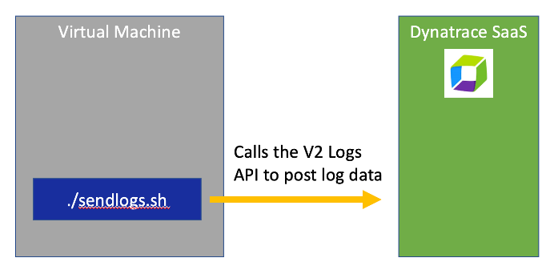

# Generic Log Ingestion

Get an overview Generic Log Ingestion in the [Dynatrace Docs](https://www.dynatrace.com/support/help/how-to-use-dynatrace/log-monitoring/log-monitoring-v2/log-data-ingest).

 

# Example Prereqs

The examples below require the following:

1. Dynatrace Environment 
1. [Dynatrace API Token](https://www.dynatrace.com/support/help/dynatrace-api/basics/dynatrace-api-authentication) with the following scopes
    * Ingest logs (API v2)
    * Write metrics (API v2)
1. Example scripts are Unix Bash, so a Unix OS or MacOS will be required to run the examples
1. Example Unix Bash script preparation
    * Cloned this repo
    * Copy the `creds.template` to `creds.json`  
    * Edited `creds.json` with my Dynatrace URL and API Token (NOTE: `creds.json` is in `.gitignore`)

# Example Generic Log Ingestion 

1. Once the `creds.json` is updated, the run the `sendlogs.sh` script.  See the comments in the for usage details.

1. View the logs within the `Logs App` within Dynatrace as shown below.

    

1. Validate with DQL

See all rows
```
fetch logs
| filter matchesValue(content, "*Custom Log Message*")
```

Summary by log level
```
fetch logs
| filter matchesValue(content, "*Custom Log Message*")
| summarize count(),by:{attribute_d}
```
