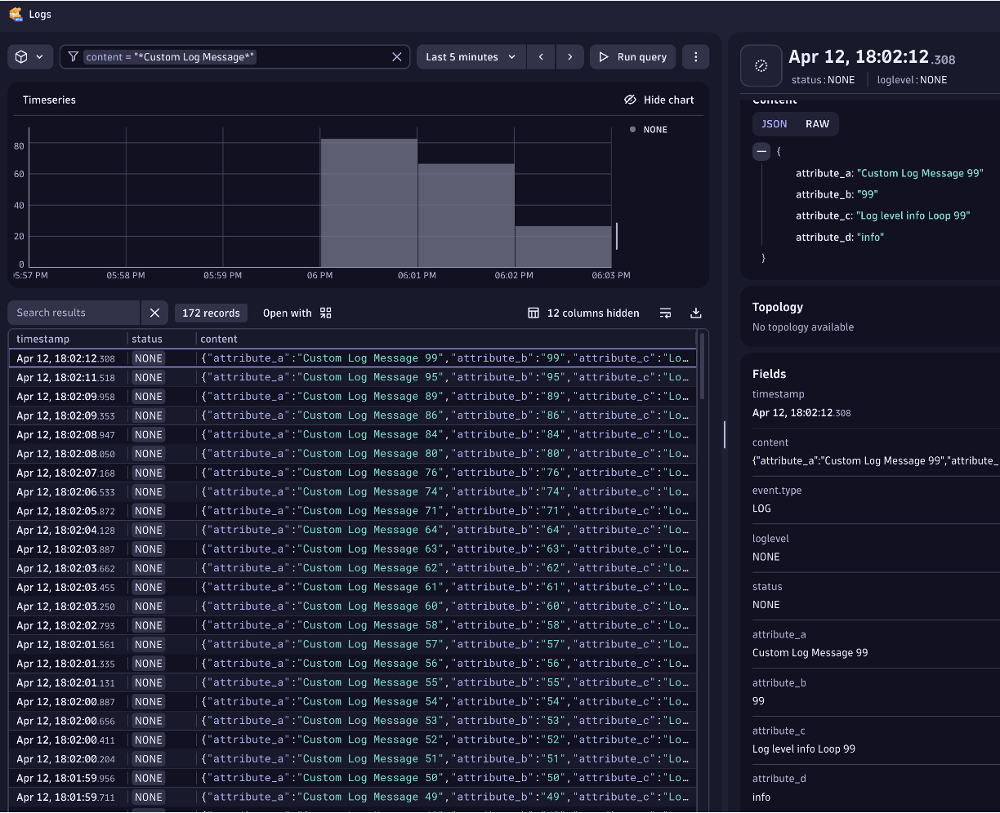

# Log content auto-discovery

The Dynatrace OneAgent can auto-discover logs if they meet certain requirements as explained in the [Dynatrace Docs](https://www.dynatrace.com/support/help/how-to-use-dynatrace/log-monitoring/log-monitoring-v2/log-content-auto-discovery-v2).


# Example Prereqs

The examples below require the following:

1. Dynatrace Environment 
1. Virtual Machine with Ubuntu O/S, OneAgent installed, and Docker as to start a sample application

## Virtual Machine setup 

1. VM running Ubuntu 20.04 LTS with a public IP and 2 CPU and 8 GM memory (for example: Azure Standard D2as v4)
1. Open port 22 for SSH access 
1. Run the following commands to install Docker

    ```
    # install docker
    # Reference: https://docs.docker.com/engine/install/ubuntu/
    sudo apt-get update
    sudo apt-get install -y ca-certificates curl gnupg lsb-release
    curl -fsSL https://download.docker.com/linux/ubuntu/gpg | sudo gpg --dearmor -o /usr/share/keyrings/docker-archive-keyring.gpg
    echo \
        "deb [arch=$(dpkg --print-architecture) signed-by=/usr/share/keyrings/docker-archive-keyring.gpg] https://download.docker.com/linux/ubuntu \
        $(lsb_release -cs) stable" | sudo tee /etc/apt/sources.list.d/docker.list > /dev/null

    sudo apt-get update
    sudo apt-get install -y docker-ce docker-ce-cli containerd.io

    # review installation
    docker version
    sudo systemctl status docker
    ```

## Sample application setup 

A sample application written in NodeJS in the `logapp/` directory will just loop to make logs.  This application was published as a Docker image as to make it easy to run.

### Start 

```
cd ~
docker run -it -e LOOPS=1000 -e LOGFILE=/mount/applog.log -v $(pwd):/mount dtdemos/logapp:1.0.0 
```

### Verify Logs

```
tail ~/applog.log
```

### Stop 

```
# get docker process id
sudo docker ps
# stop and remove process
sudo docker stop <process id>
sudo docker rm <process id>

```

# Example Log Ingestion 

Now that the application is running, we need to enable the log capture.

1. Setup a VM with the OneAgent.  By default auto-discovered logs are enabled

    

1. Goto `Settings -> Log Monitoring -> Log sources and storage`

1. View the logs within the `Observe and explore -> Logs` page within Dynatrace as shown below.

    
