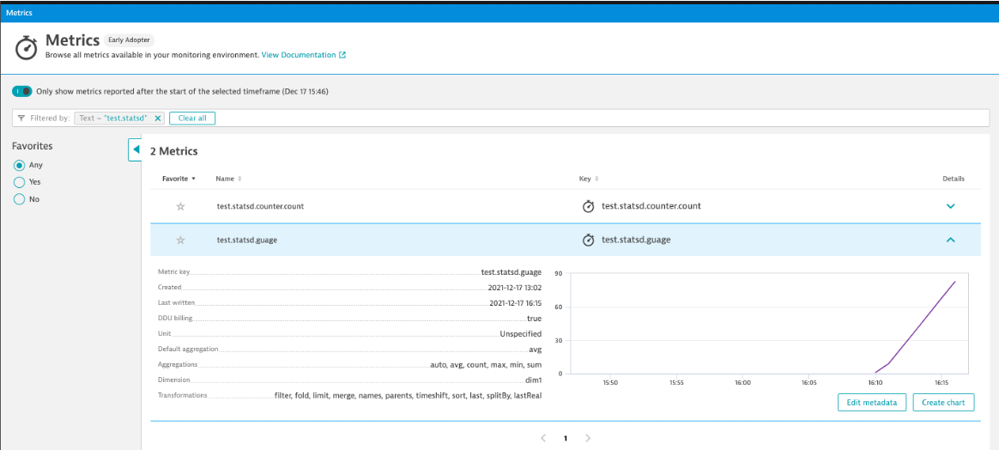
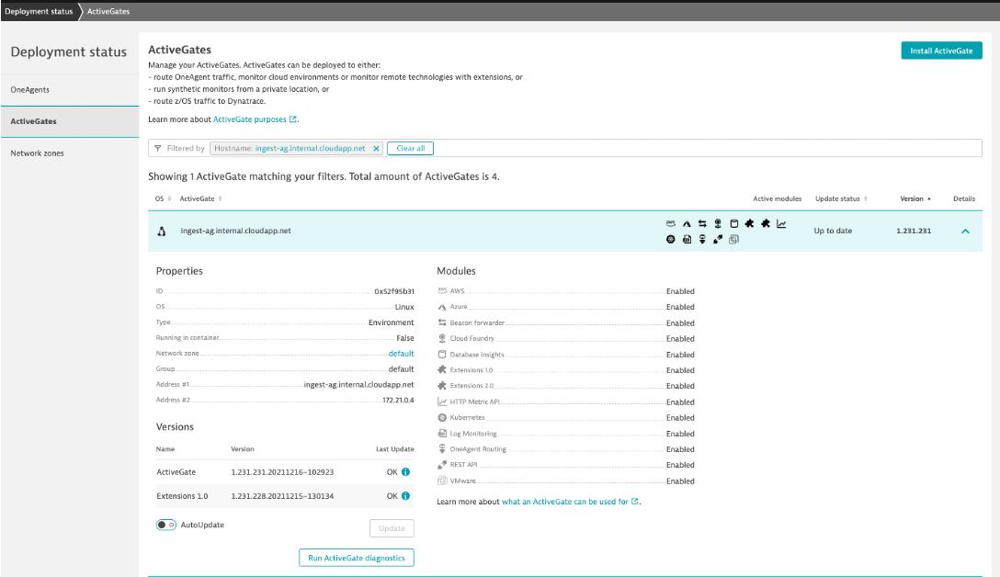

# Overview

This repo contains some examples for trying out Dynatrace's [log monitoring v2](https://www.dynatrace.com/support/help/how-to-use-dynatrace/log-monitoring/log-monitoring-v2) and [metric ingestion](https://www.dynatrace.com/support/help/how-to-use-dynatrace/metrics/metric-ingestion).

## Prereqs to examples

1. Dynatrace Environment 
1. [Dynatrace API Token](https://www.dynatrace.com/support/help/dynatrace-api/basics/dynatrace-api-authentication) with the following scopes
    * Ingest logs (API v2)
    * Write metrics (API v2)
1. Example scripts are Unix Bash, so a Unix OS or MacOS
1. Example Unix Bash script preparation
    * Cloned this repo
    * Copy the `creds.template` to `creds.json`  
    * Edited `creds.json` with my Dynatrace URL and API Token (NOTE: `creds.json` is in `.gitignore`)

# Generic Log Ingestion 

The `sendlogs.sh` example script using the [Dyntrace Metrics V2 API](https://www.dynatrace.com/support/help/dynatrace-api/environment-api/log-monitoring-v2/post-ingest-logs) to ingest logs.
* See the comments in the `sendlogs.sh` script for usage details.
* Get an overview Generic Log Ingestion in [Dynatrace Docs](https://www.dynatrace.com/support/help/how-to-use-dynatrace/log-monitoring/log-monitoring-v2/log-data-ingest).

You an view the logs within the `Observe and explore -> Logs` page within Dynatrace as shown below.


# StatsD metrics

The `sendstats.sh` example script to send stats data sets using the unix [nc](https://www.computerhope.com/unix/nc.htm) utility. The default usage is to send metrics to a OneAgent process on a host listening on port 18125. So this means you run the `sendstats.sh` on the same host as the OneAgent. You can also run `sendstats.sh` anywhere like your laptop if you install the ActiveGate on a host with public port and IP, configure the ActiveGate, and then pass in the IP and ActiveGate port as arguments to the `sendstats.sh` script.
* See the comments in the `sendstats.sh` script for usage details. 
* Follow the [Dynatrace Docs](https://www.dynatrace.com/support/help/how-to-use-dynatrace/metrics/metric-ingestion/ingestion-methods/statsd#enable-dynatracestatsd) to enable on a host running an OneAgent
* See the `ActiveGate setup` section below for the ActiveGate setup

You an view the logs within the `Observe and explore -> Logs` page within Dynatrace as shown below filtered to text of `test.statsd`.



## ActiveGate setup

Here is picture of installed ActiveGate.  The install ActiveGate button is on the top right.


I followed the `Enable remote StatsD` section of the [Dynatrace Docs](https://www.dynatrace.com/support/help/how-to-use-dynatrace/metrics/metric-ingestion/ingestion-methods/statsd), but here are additional notes. 

1. Cloud VM running Ubuntu 20.04 LTS with a public IP and 2 CPU and 8 GM memory (Azure Standard D2as v4)
1. Open port 22 for SSH access 
1. Open port 18126 - to support the statsD `nc` calls
1. Open port 443 - optionally to support calling [Dyntrace Metrics V2 API](https://www.dynatrace.com/support/help/dynatrace-api/environment-api/log-monitoring-v2/post-ingest-logs) via the ActiveGate
1. Installed the [ActiveGate](https://www.dynatrace.com/support/help/setup-and-configuration/dynatrace-activegate) using the Linux installation script on the `Deployment Status -> ActiveGate` page in my Dynatrace Tenant.
1. Adjusted the this file have `statsdenabled=true` and `StatsdPort=18126`

    ```
    sudo vi /var/lib/dynatrace/remotepluginmodule/agent/conf/extensionsuser.conf
    ```

1. Restarted the ActiveGate

    ```
    sudo systemctl restart dynatracegateway
    sudo systemctl status dynatracegateway
    ```

1. Referred to these logs when sent in logs

    ```
    cd /var/lib/dynatrace/remotepluginmodule/log/extensions/datasources
    sudo tail dynatracesourcestatsd.log -f
    ```
