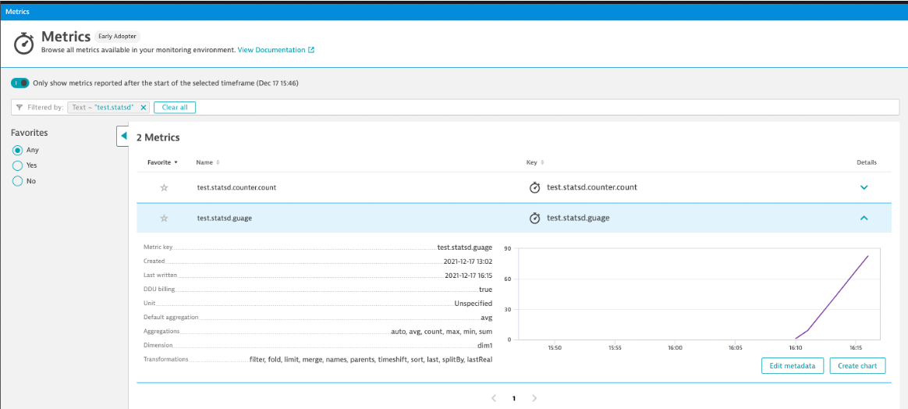
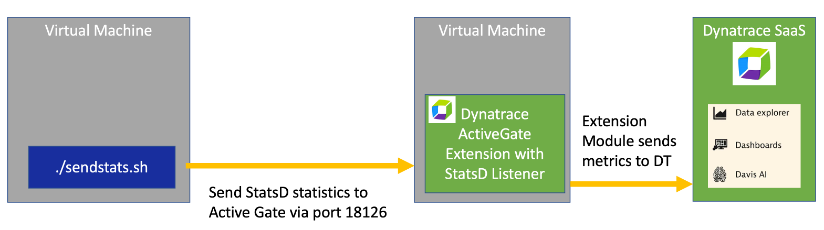
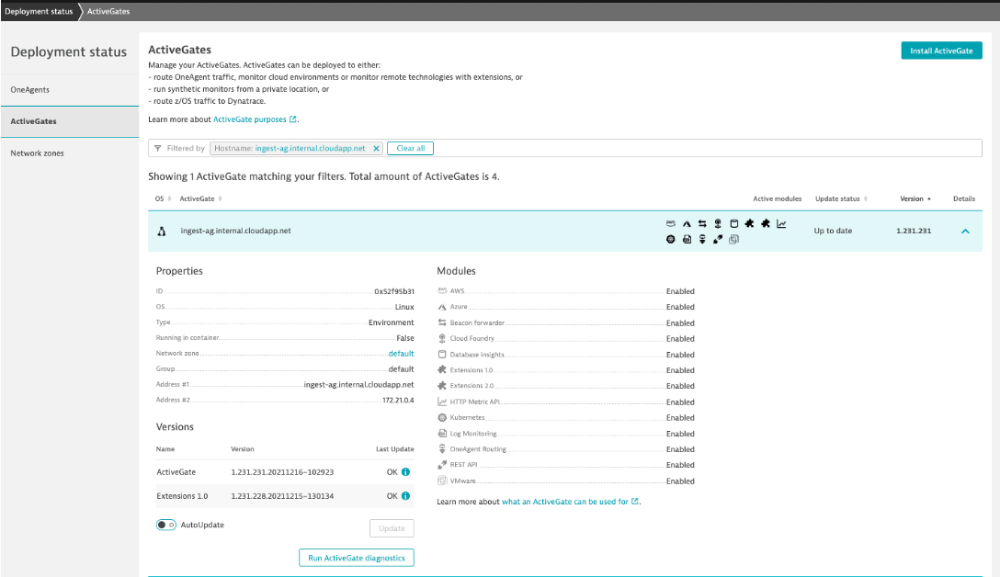

# StatsD Metrics 

Get an overview StatsD Log Ingestion in the [Dynatrace Docs](https://www.dynatrace.com/support/help/how-to-use-dynatrace/metrics/metric-ingestion/ingestion-methods/statsd), but there are two forms: OneAgent and remote listener on a Dynatrace ActiveGate.

In this repo is a `sendstats.sh` script that will send StatsD metrics using the unix [nc](https://www.computerhope.com/unix/nc.htm) utility. 

# Approach #1: Virtual Machine with OneAgent StatsD Listener


## Prereqs

This approach requires the following:

1. Dynatrace Environment 
1. Virtual Machine with OneAgent installed and Extensions Execution Controller enabled
1. Clone the sample scripts to get the `sendstats.sh` script

## Example

This example follows the `Enable for a single host` section of the [Dynatrace Docs](https://www.dynatrace.com/support/help/how-to-use-dynatrace/metrics/metric-ingestion/ingestion-methods/statsd), but here are additional notes. 

1. VM running Ubuntu 20.04 LTS with 2 CPU and 8 GM memory (for example: Azure Standard D2as v4)
1. Install OneAgent
1. Go to `Hosts` menu and open on the new host
1. On the host page, click `Settings` and be on the `general` page
1. Find the `Extensions Execution Controller` configuration and enable `Enable on this host` and `Use host configuration`
1. Find the `Dynatrace StatsD` configuration and enable `Enable on this host` and `Use host configuration` 
1. The default usage is to send metrics to a OneAgent process on a host listening on port 18125. So this means you run the `sendstats.sh` on the same host as the OneAgent.  This script will loop to send metrics.  

1. To view metrics, open the `Metrics` menu option in Dynatrace and filter by `test.statsd` as as shown below.

    

# Approach #2: ActiveGate with Remote StatsD Listener



# Prereqs

This approach requires the following:

1. Dynatrace Environment 
1. Virtual Machine with ActiveGate installed and port 18126 opened

## Example

This example follows the `Enable remote StatsD` section of the [Dynatrace Docs](https://www.dynatrace.com/support/help/how-to-use-dynatrace/metrics/metric-ingestion/ingestion-methods/statsd), but here are additional notes. 

1. VM running Ubuntu 20.04 LTS with a public IP and 2 CPU and 8 GM memory (for example: Azure Standard D2as v4)
1. Open port 22 for SSH access 
1. Open port 18126 - to support the statsD `nc` calls
1. Installed the [ActiveGate](https://www.dynatrace.com/support/help/setup-and-configuration/dynatrace-activegate) using the Linux installation script on the `Deployment Status -> ActiveGate` page in my Dynatrace Tenant.
    * NOTE: I used version 1.231 in my environment.  Minimum version is 1.227
    * Here is picture of installed ActiveGate.  The install ActiveGate button is on the top right.

        

1. On the VM, adjust this file have `statsdenabled=true` with the default setting of `StatsdPort=18126`

    ```
    sudo vi /var/lib/dynatrace/remotepluginmodule/agent/conf/extensionsuser.conf
    ```

1. Restart the ActiveGate

    ```
    sudo systemctl restart dynatracegateway
    sudo systemctl status dynatracegateway
    ```

1. Verify statsD process is running

    ```
    ps -ef | grep stat
    ```

    You should see output like:

    ```
    dtuserag   59961   59950  0 Dec21 ?        00:15:08 /opt/dynatrace/remotepluginmodule/agent/datasources/statsd/dynatracesourcestatsd --dsid=statsd_0 --url=http://127.0.0.1:14599 --idtoken=/var/lib/dynatrace/remotepluginmodule/agent/runtime/datasources/dsauthtoken
    ```

1. Verify the ActiveGate is listening on port 18126

    ```
    sudo lsof | grep 18126
    ```

    You should see output like:

    ```
    dynatrace  48594                         dtuserag    9u     IPv6             210910      0t0        UDP *:18126 
    dynatrace  48594  48596 dynatrace        dtuserag    9u     IPv6             210910      0t0        UDP *:18126 
    dynatrace  48594  48597 dynatrace        dtuserag    9u     IPv6             210910      0t0        UDP *:18126 
    dynatrace  48594  48598 dynatrace        dtuserag    9u     IPv6             210910      0t0        UDP *:18126 
    dynatrace  48594  48599 dynatrace        dtuserag    9u     IPv6             210910      0t0        UDP *:18126 
    dynatrace  48594  48600 dynatrace        dtuserag    9u     IPv6             210910      0t0        UDP *:18126 
    dynatrace  48594  48601 dynatrace        dtuserag    9u     IPv6             210910      0t0        UDP *:18126 
    dynatrace  48594  48635 dynatrace        dtuserag    9u     IPv6             210910      0t0        UDP *:18126 
    dynatrace  48594  99627 dynatrace        dtuserag    9u     IPv6             210910      0t0        UDP *:18126 
    ```

1. Referred to these logs when sent in logs

    ```
    cd /var/lib/dynatrace/remotepluginmodule/log/extensions/datasources
    sudo tail dynatracesourcestatsd.log -f
    ```

1. To send metrics, use call the `sendstatsd.sh` from another location like your laptop to the public IP and port 18126.  For example  

    ```
    ./sendstatsd.sh 111.222.333.444 18126
    ```

1. To view metrics, open the `Metrics` menu option in Dynatrace and filter by `test.statsd` as as shown below.

    